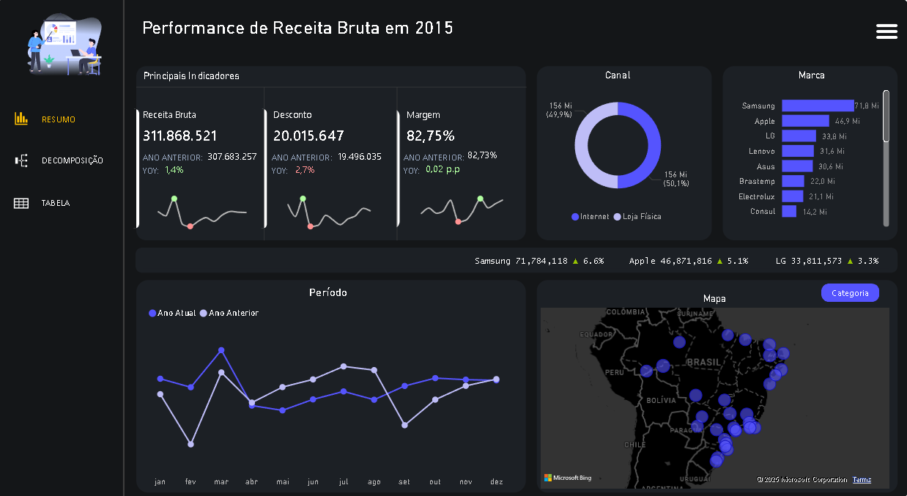

## 📊 Dashboard de Análise de Vendas — Power BI
Este projeto é um dashboard interativo desenvolvido no Power BI com o objetivo de analisar o desempenho de vendas de uma empresa fictícia. A solução visa demonstrar habilidades em modelagem de dados, criação de medidas com DAX e uso de Power Query, além de boas práticas visuais para facilitar a interpretação dos dados.

## 🧠 Objetivos do Projeto
- Consolidar aprendizados em Power BI, DAX e Power Query

- Criar uma visão gerencial de vendas segmentada por ano, mês, categoria, subcategoria, produto e canal

- Simular uma aplicação real de Business Intelligence voltada para a área comercial

 

## 🧩 Modelagem de Dados
O projeto foi estruturado seguindo o padrão Star Schema (Esquema Estrela), com as seguintes tabelas:

- Fato Vendas — contém dados de cada venda (valor, quantidade, datas, IDs)

- Dim_produto

- Dim_caategoria

- Dim_canal

- Dim_data — criada e tratada no Power Query

## ⚙️ Ferramentas Utilizadas
- Power BI Desktop

- Power Query — para limpeza e transformação dos dados

- DAX — para criação de medidas como:

    Faturamento total

    Ticket médio

    Crescimento percentual

    Comparação entre períodos

- Painéis e segmentações — com filtros por data, canal, produto e categoria

## 🔎 Funcionalidades do Dashboard
- Indicadores de performance (KPIs) em destaque

- Gráficos de linha para análise de tendência ao longo do tempo

- Visualizações segmentadas por:
  Período

  Produto

  Categoria

  Canal de venda

- Layout responsivo e intuitivo, com menu retrátil interativo

link para o projeto: https://app.powerbi.com/view?r=eyJrIjoiMGJlMDQ2MWUtNWNkNC00OWRhLTg3NTktYWJhMWJlOTY0M2JiIiwidCI6IjE2OGQ0MTM3LWQ2ZjYtNDVmOC1hYWE3LWQxYTcwMjMzMDk1ZSIsImMiOjR9
